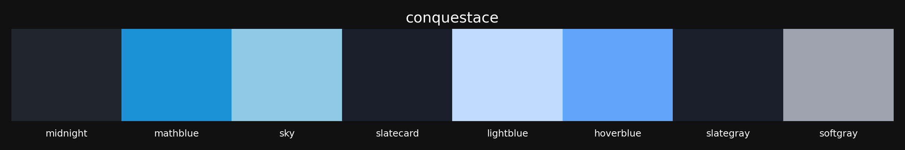
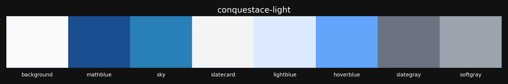
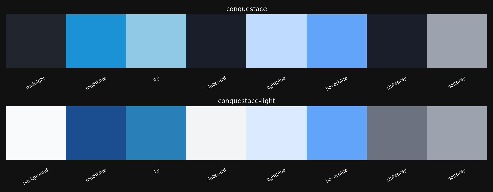

# My themes and colour Palette Generator

This project generates colour palettes from a JSON theme file and visualizes them using Matplotlib. The generated palettes can be saved as individual images or combined into a single grid image.





## Features

- Convert hex colours to RGB format.
- Draw colour palettes for themes.
- Save individual palette images.
- Generate a combined grid of all palettes.

## Requirements

To run this project, you need to have the following Python packages installed:

- `matplotlib`
- `numpy`
- `json`

You can install the required packages using pip:

```bash
pip install -r requirements.txt
```

## Usage

1. **Prepare a `themes.json` file**: This file should contain your colour themes in JSON format. An example `themes.json` file is provided in the repository.
2. **Run the script**: Execute the script to generate the palettes. The script will read the `themes.json` file, generate the palettes, and save them as images.

```bash
python generate_palettes.py
```

## Example `themes.json`

```json
{
    "conquestace": {
      "colours": {
        "midnight": "#21252d",
        "mathblue": "#1b91d6",
        "sky": "#8ecae6",
        "slatecard": "#1a1e2a",
        "lightblue": "#bfdbfe",
        "hoverblue": "#60a5fa",
        "slategray": "#1a1e2a",
        "softgray": "#9ca3af"
      }
    },
    "conquestace-light": {
      "colours": {
        "background": "#f9fafb",
        "mathblue": "#1b4d91",
        "sky": "#297fb8",
        "slatecard": "#f3f4f6",
        "lightblue": "#dbeafe",
        "hoverblue": "#60a5fa",
        "slategray": "#6b7280",
        "softgray": "#9ca3af"
      }
    }
}
```
## Generated Palettes

After running the script, you can view the generated palettes in the `palettes` directory. Here are some examples:


